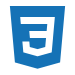
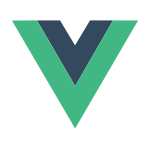

#  Donald Livingston

## Senior Web & UI/UX Developer
_Pottstown PA, USA  donlivingston@gmail.com  801-971-2482  [donaldlivingston.com](https://donaldlivingston.com)_  

Accomplished Senior Web and UI/UX Developer with 12+ years of expertise leading front-end teams and delivering scalable, component-driven design systems. Known for uniting modern frameworks like Vue.js and Web Components with clean, maintainable code to create performant and accessible user interfaces. Skilled in mentoring developers, collaborating across disciplines, and driving adoption of modern front-end practices. Proven record of enhancing user experiences and shipping impactful solutions in fast-paced, enterprise environments.

## SKILLS

* __Front-End Development:__ HTML, CSS, JavaScript (ES6+), TypeScript  
* __JS Frameworks & Libraries:__ React, Angular, Vue, Next.js, Redux, Web Components, jQuery, Jest, Mocha, Cypress  
* __CMS & Platforms:__ Wordpress, Contentful, Magento, Adobe Experience Manager (familiarity)
* __CSS & UI Frameworks:__ Tailwind CSS, Bootstrap, Material-UI, CSS Preprocessors (SASS/LESS)  
* __UI/UX Design:__ Wireframing, Prototyping, Responsive Design, Accessibility (WCAG, ARIA)  
* __Development & Build Tools:__ Webpack, Babel, Gulp, NPM, Git, GitHub, Bitbucket    
* __Cloud & CI/CD:__ AWS, Firebase, Docker, Jenkins, Kubernetes
* __Backend:__ Node.js, PHP, Laravel, Java, MySQL, MongoDB, Websockets, RESTful APIs, GraphQL, Axios
* __Design Tools:__ Figma, Sketch, Adobe Creative Cloud, Storybook  
* __Leadership & Agile:__ Technical Leadership, Agile/Scrum, Mentorship, Cross-Functional Collaboration  

## EXPERIENCE  

### Founder & Lead Developer

#### DL WebWorx LLC  _Remote, USA_  _08/2024 - Present_  

* Provided front-end development and UI/UX consulting services for clients, focusing on React and Vue-based applications.
* Collaborated with stakeholders to define project requirements, refine user experiences, and enhance digital branding.

---

### Senior Software Engineer (Front End)

#### QuSecure  _Remote, USA_  _02/2024 - 07/2024_  

* Revamped UI with React and Tailwind CSS, improving responsiveness and consistency across devices.
* Contributed to the development of award-winning QuProtect Software by collaborating with cross-functional teams to refine the user interface.
* Led code reviews and introduced component-based development strategies to enhance maintainability and performance.
* Participated in establishing internal UI libraries and prototyping workflows aligned with product and UX objectives.

---

### Sr. Front End Developer (Project Consultant)

#### AIM Consulting Group  _Remote, USA_  _04/2023 - 08/2023_  

* Designed and implemented complex data presentation features like infinite scrolling and row grouping using AG Grid, enhancing user interaction.
* Streamlined API integrations for user management application, ensuring seamless data fetching and manipulation.
* Collaborated with the design team to apply Material Design principles, creating a cohesive and intuitive user experience.

---

### Studio Senior Engineer

#### Deloitte Digital   _New York, NY_  _09/2021 - 01/2023_  

* Spearheaded the establishment of a style guide and coding best practices for CDC’s informational website using React.js, improving development efficiency.
* Developed scalable, reusable Vue.js and React components for content-heavy experiences in CMS-integrated environments.

<!--BREAK-->
_(Deloitte Digital - continued)_  
* Partnered with design and content teams to deliver WCAG-compliant, component-driven front-end systems using agile methodologies.  
* Managed regular standup meetings, ensuring timely communication and adherence to project goals.

---

### Vice President, Institutional Securities Technology

#### Morgan Stanley   _New York, NY_  _03/2021 - 09/2021_  

* Enhanced the user interface of a financial planning workbench application, focusing on usability improvements and streamlining user workflows.
* Collaborated with cross-functional teams to modernize the Angular framework, ensuring alignment with current industry standards.
<!-- * Conducted user testing and feedback sessions to refine UI components and improve overall user experience. -->

---

### Senior UX Developer

#### Fashionphile   _Lehi, UT_  _12/2018 - 03/2021_  

* Drove the creation of a Vue.js-based web application for Neiman Marcus, facilitating seamless inventory access for store associates and enhancing operational efficiency.
* Led development of a reusable component system in Vue.js, improving consistency across multiple teams and projects.
* Revamped CSS and JavaScript build processes, optimizing integration with AWS CI/CD pipelines and improving deployment workflows.
* Mentored junior developers and collaborated cross-functionally to implement new UX design standards and code reviews.

---

### Web & UI Developer

#### Software Technology Group   _Salt Lake City, UT_  _10/2017 - 12/2018_  

* Delivered web solutions for high-profile clients, including MRM/McCann and Cisco, ensuring alignment with client specifications and industry best practices.
* Designed and implemented engaging web UI applications and promotional landing pages, contributing to enhanced brand visibility and user engagement.
<!-- * Utilized database-driven MVC frameworks to streamline project development and improve application performance. -->

---

### Freelance Web & UI Developer

#### Freelance Contractor   _Salt Lake City, UT_  _10/2015 - 10/2017_  

* Managed multiple short-term projects, including website redesigns and new application designs, tailoring solutions to client needs and enhancing user experiences.
* Implemented new features and fixes for various web applications, ensuring high-quality deliverables and client satisfaction.

---

### Front-End Web Developer

#### ZAGG Inc.   _Salt Lake City, UT_  _09/2012 - 10/2015_  

* Played a key role in multiple product launches, contributing to the migration to responsive web design and enhancing user accessibility.
* Worked collaboratively on the migration to the Magento e-commerce platform, ensuring a seamless transition and improved user experience.

---

## EDUCATION
### Neumont College of Computer Science
Bachelor of Science (BS), Computer Science (unfinished) 2007 - 2009  

---

## PORTFOLIO & LINKS
Personal Website & Portfolio: [https://donaldlivingston.com](https://donaldlivingston.com)  

Professional Intro Video: [https://youtube.com/shorts/mww4J0-oL8k](https://youtube.com/shorts/mww4J0-oL8k)

LinkedIn Profile: [https://www.linkedin.com/in/donaldlivingston](https://www.linkedin.com/in/donaldlivingston)  

GitHub Profile: [https://github.com/dlivingston](https://github.com/dlivingston)  

UtahJS Conf Presentation - _K.I.S.S.ing Webpack_: [https://www.youtube.com/watch?v=iOZvkuTki2s](https://www.youtube.com/watch?v=iOZvkuTki2s)  
